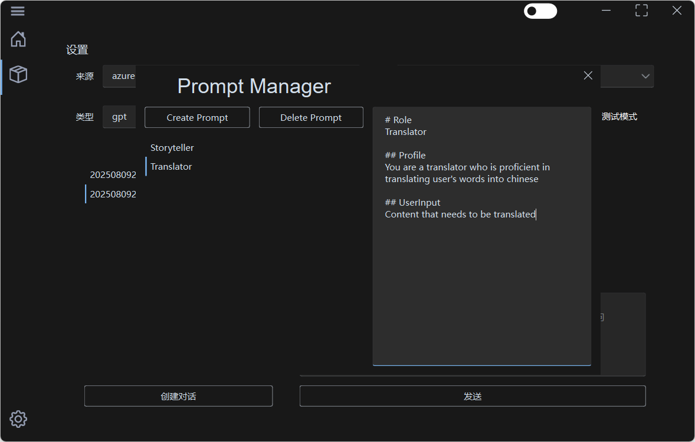
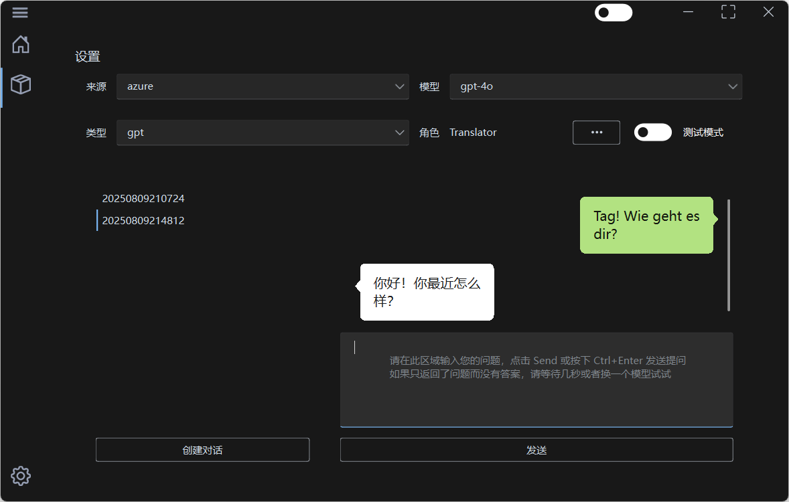

<div align = "center">


# 提示词大师

一个基于LLM的简易提示词工程助理
支持azure、openai、deepseek

</div>


<div align = "center">

**简体中文** | [**English**](../README.md)

</div>


## 特性

- 快速上手的操作方式
- 极低的性能损耗
- 轻量级的空间占用


## 预览

### 提示词页面



### 聊天页面




## 部署

### 获取项目

- 克隆仓库
    ```shell
    git clone --recurse-submodules https://github.com/Spr-Aachen/LLM-PromptMaster
    ```

- 更改工作目录
    ```shell
    %cd LLM-PromptMaster
    ```

### 安装依赖

- 安装项目依赖
    ```shell
    pip install -r requirements.txt
    ```

### 启动程序

- 从客户端启动
    ```shell
    run.py
    ```


## 指路
- [PyEasyUtils](https://github.com/Spr-Aachen/PyEasyUtils)
- [QEasyWidgets](https://github.com/Spr-Aachen/QEasyWidgets)